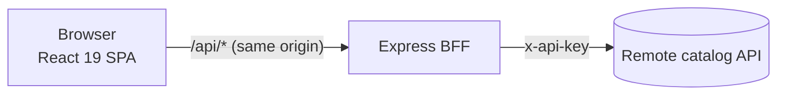
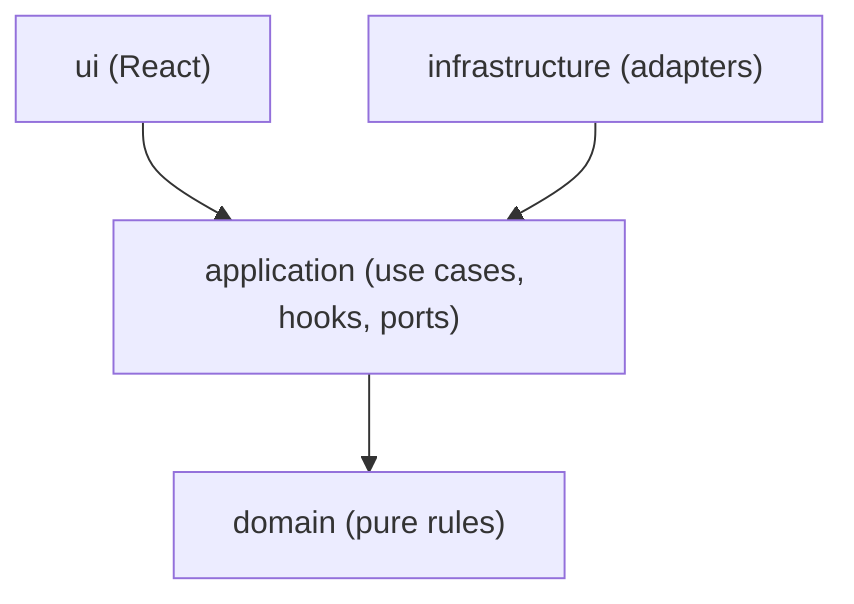

# MBST phone catalog

[](https://github.com/JulioGT/mbst-phone-catalog/actions/workflows/ci.yml)

A phone catalog built for the Inditex / Zara frontend challenge: browse and search smartphones, pick storage and color, and keep a cart between visits. A **React 19** app talks only to its own **Express BFF** (backend for frontend), which holds the API key and cleans up the remote catalog API. Both apps follow **hexagonal architecture**, enforced by an automated check.

- [Quick start](#quick-start)
- [What it does](#what-it-does)
- [Architecture](#architecture)
- [Project structure](#project-structure)
- [Key decisions](#key-decisions)
- [Quality](#quality)
- [Working with AI agents](#working-with-ai-agents)
- [Known limitations and next steps](#known-limitations-and-next-steps)

## Quick start

**Requirements:** Node **20.19 or newer** and **pnpm 12**.

```bash
npm install -g pnpm@12.8.1   # pnpm then follows the version pinned in package.json
pnpm install                 # also installs the pre-commit hook
cp .env.example .env         # then set CATALOG_API_KEY to the key given in the challenge statement
```

The API key is deliberately **not** in the repository. It is only read by the BFF and never reaches the browser.

| Mode | Command | Open | What you get |
|---|---|---|---|
| Development | `pnpm dev` | http://localhost:3001 | Unminified assets with source maps and hot reload (Rsbuild), BFF on :3000 with auto-restart |
| Production | `pnpm preview` | http://localhost:3001 | Builds first, then serves **concatenated, minified, content-hashed** assets, with the BFF on :3000 |

In both modes the browser only calls `/api/*` on its own origin; Rsbuild proxies it to the BFF.

### All scripts

| Command | Does |
|---|---|
| `pnpm dev` | Web app and BFF in watch mode |
| `pnpm build` | Production build of the web app (`apps/web/dist`) |
| `pnpm preview` | `build`, then serve it with the BFF |
| `pnpm test` | Unit and integration tests in every workspace |
| `pnpm verify` | Lint + format check, architecture rules, architecture tests, typecheck, tests. CI runs it on Node 20 and 22, plus `pnpm build` |
| `pnpm lint:fix` | Apply safe lint and format fixes (Biome) |
| `pnpm check:contract` | Manual: checks the **live** catalog API against our schemas (needs `.env`) |

## What it does

Every requirement of the challenge, and where it lives:

| Requirement | Implementation |
|---|---|
| Grid with the first 20 phones: image, name, brand, base price | `ProductListPage`, `ProductGrid`, `ProductCard`. 1, 2 or 5 columns (mobile, tablet, desktop) |
| Real-time search by name or brand, **filtered by the API** | `SearchBox` + `useProductSearch`. Debounced (300 ms), the previous request is aborted, the term lives in the URL (`/?q=samsung`) so Back and shared links work |
| Result count | `N RESULTS`, announced to screen readers |
| Navbar: home link, cart icon with count | `Header`. The bag is filled when the cart has phones |
| Persistent cart (`localStorage`) | `CartProvider` + `LocalStorageCartStorage`. Stored data is validated, so corrupt or blocked storage never crashes the app |
| Detail: name, brand, large image changing with color | `ProductPurchase`. All color images are preloaded, so switching is instant |
| Storage and color selectors with live price | Native radio groups. Price is `From {base price} EUR` until a storage is chosen, then that storage's price |
| Specs, base price, price per storage | `SpecificationsTable` (fixed rows, missing values marked) and the storage selector |
| "Añadir al carrito" only with color and storage chosen | `AÑADIR` stays unavailable and **says what is missing**; a single option is preselected |
| Similar products | `SimilarProducts` carousel, behind the `similar-products` feature flag |
| Cart: image, name, storage / color, price, remove, total, continue shopping | `CartPage`, `CartLine`. Removing moves focus sensibly and is announced; `PAY` is shown as designed but disabled (checkout is out of scope) |
| Responsive, following Figma; Helvetica/Arial | Mobile-first CSS Modules with design tokens (`tokens.css`); checked from 320 px to 1920 px |
| Dev mode unminified, prod mode concatenated and minified | Rsbuild defaults, see [Quick start](#quick-start) |
| Tests, accessibility, linters and formatters, clean console | See [Quality](#quality) |
| Node 18, React ≥ 17, React Context, `x-api-key` | React 19 with Context; the key is sent by the BFF only. **Node 20.19+ instead of 18**, see [Key decisions](#key-decisions) |
| Optional: CSS variables | Yes: design tokens as custom properties |
| Optional: SSR, deployment | Planned next, see [Known limitations](#known-limitations-and-next-steps) |

## Architecture



**Why a BFF.** The API key must never reach the browser, and the remote API has quirks the UI should not inherit: `http://` image URLs, decimal prices, a duplicated product, missing spec fields, and a `basePrice` that is not always the cheapest option. The BFF validates every response with Zod and fixes all of that in **one adapter**, so the UI receives clean data with prices in integer cents. Findings from the live API are recorded in [`docs/api-contract.md`](docs/api-contract.md).

**Hexagonal architecture in both apps.** Business rules do not know about HTTP, Express, React or `localStorage`:



- `domain`: plain TypeScript rules, such as money in cents, the cart, the list query, and the selection rules ("what price to show", "can this be added").
- `application`: use cases (BFF) or hooks and context (web), plus **ports**, the interfaces for the outside world (`ProductCatalogPort`, `CatalogGateway`, `CartStorage`, `FeatureFlagsPort`, `Logger`).
- `infrastructure`: **adapters** that implement the ports: the HTTP client to the remote API, Express routes, `localStorage`, environment feature flags.
- `ui` (web only): pages and components; they get data from hooks, never from adapters.
- `main.ts` / `main.tsx`: the composition roots, the only place where adapters are created and wired.

**The rules are enforced, not just documented.** `pnpm check:arch` (dependency-cruiser) fails the build if, for example, the domain imports a package or a component imports an adapter, and `pnpm test:arch` proves each rule actually fires on a fixture project.

**Two models, one wire format.** The BFF and the web app each have their own domain types. They share only [`packages/contracts`](packages/contracts/src/index.ts): the JSON shapes and Zod schemas of the BFF's API. The BFF maps its domain to that contract; the web app validates the response against the same schema and maps it to its own domain. A contract change becomes a compile error on both sides.

**A search, end to end:** typing pauses for 300 ms → the term goes to the URL → `useProductSearch` aborts the previous request and calls `CatalogGateway` → `GET /api/products?search=…` → the BFF use case validates the query (1-50 results, max 100 characters) → the catalog adapter asks the remote API for 5 extra items, removes duplicates, converts prices and image URLs → the contract DTO goes back → the web gateway validates and maps it → the grid renders and the count is announced.

More: [`docs/architecture.md`](docs/architecture.md), [`docs/bff.md`](docs/bff.md), [`docs/frontend.md`](docs/frontend.md).

## Project structure

```
apps/
  bff/                     Express BFF
    src/domain/            Product, Money, ProductQuery, errors
    src/application/       ListProducts, GetProductDetail, ports
    src/infrastructure/    catalog (HTTP + in-memory), http (Express), config, flags, logging
    src/main.ts            composition root
    scripts/               check-contract.ts
    test/                  Mocha + Chai tests, local stub of the remote API
  web/                     React app
    src/domain/            Money, Cart, ProductSelection
    src/application/       CartProvider, useProductSearch, useProductDetail, ports
    src/infrastructure/    HttpCatalogGateway, LocalStorageCartStorage
    src/ui/                pages, components, styles (tokens.css), routes
    src/copy.ts            every user-facing string
    src/main.tsx           composition root
    test/                  Jest setup, builders, test doubles
packages/contracts/        wire types + Zod schemas shared by both apps
tools/architecture/        tests for the architecture rules
docs/                      architecture, API contract, IA, design system, testing, ADRs
.claude/skills/            task recipes for AI coding agents
```

## Key decisions

Each costly-to-reverse decision has a short record in [`docs/decisions/`](docs/decisions/):

- **Rsbuild + Express instead of Next.js** ([ADR 0004](docs/decisions/0004-rsbuild-express-ssr.md)). The challenge suggests Next.js for the optional SSR; this stack (Rsbuild, Express BFF, pnpm workspaces, Turborepo, Biome) matches the target role, and SSR is planned on top of it.
- **Node 20.19+ instead of Node 18** ([ADR 0010](docs/decisions/0010-node-20-baseline.md)). Node 18 is end-of-life since April 2025 (no security fixes), and current Rsbuild and React Router need Node 20.
- **Money in integer cents; cart lines are snapshots** ([ADR 0006](docs/decisions/0006-money-and-cart-snapshots.md)). `553.31` becomes `55331` at the BFF boundary; each add is its own line with the price seen at that moment.
- **A single option is preselected** ([ADR 0007](docs/decisions/0007-preselect-single-option.md)), so phones with one storage or one color can be added right away.
- **"From X EUR" uses the API's base price, as in the design**, even though for 5 of 23 phones a cheaper storage exists (a product-owner decision, recorded in [`docs/api-contract.md`](docs/api-contract.md)).
- **CSS Modules + design tokens** ([ADR 0005](docs/decisions/0005-css-tokens.md)): no runtime CSS-in-JS, straightforward SSR, design values in one file.
- **Feature flags evaluated in the BFF** ([`docs/feature-flags.md`](docs/feature-flags.md)): with `similar-products` off, the API omits the field and the UI hides the section. A GrowthBook adapter would implement the same port.
- **Search in the URL, debounced, with stale requests aborted**, so fast typing never shows results for an old term.

Deliberate deviations from the Figma frames (contrast, focus rings, touch targets, messages for states the design omits) are listed in [`docs/design-system.md`](docs/design-system.md#deviations-from-the-design-deliberate).

## Quality

**Tests: 175** (78 BFF + 97 web), written with the code, not afterwards.

- BFF: Mocha + Chai. Use cases against in-memory adapters; the HTTP adapter against a **local stub of the remote API** (timeouts, 401, 404, malformed payloads, duplicates, `http` images); routes with supertest.
- Web: Jest + React Testing Library + user-event. Tests query by role and label, as a user would; every page test includes a **jest-axe** accessibility check; fake timers for the debounce; a controlled gateway for out-of-order responses.
- **Any `console.error` or `console.warn` fails the test run**, which keeps the browser console clean.
- Key rules were **mutation-checked**: each was broken on purpose to confirm a test fails.

**Accessibility (WCAG 2.1 AA target).** Semantic HTML first (native radio groups, a real table, landmarks, one `h1` per page), visible focus everywhere, a skip link, focus moved to the new page's heading after navigation, live regions for result counts, price changes, additions and removals, `lang="es"` on Spanish text, and 44 px touch targets on the icon-only controls. In the production build: **0 axe violations** on every page state (including color contrast), keyboard-only walkthrough, and no horizontal scroll from 320 px to 1920 px. See the checklist in [`docs/testing.md`](docs/testing.md#manual-quality-checks-chunk-8-2026-09-30).

**Clean console.** A full session on the production build (search, detail, add, cart, remove, unknown page) logs nothing.

**Linting and formatting.** Biome (lint + format + import order), TypeScript `strict` with `noUncheckedIndexedAccess` and `exactOptionalPropertyTypes`, no `any`, no `!`, no `console.*`. A **pre-commit hook** blocks badly formatted files; **CI** runs `pnpm verify` and `pnpm build` on Node 20 and 22, and `main` only accepts pull requests that pass.

**Git workflow.** Short-lived branches, Conventional Commits, one pull request per chunk, rebase merges ([`docs/git-workflow.md`](docs/git-workflow.md)).

## Working with AI agents

The project was built with an AI coding agent (Claude Code) under human direction, and the repository is set up so agents can work on it safely:

- [`AGENTS.md`](AGENTS.md) (also loaded through `CLAUDE.md`): commands, architecture rules, conventions, what needs approval first, and what never to do.
- [`.claude/skills/`](.claude/skills/): step-by-step recipes for recurring tasks (add a use case, an adapter, a component, tests).
- [`docs/product-language.md`](docs/product-language.md): one vocabulary for code, tests and copy, so agents and humans name things the same way.
- **Guardrails that do not rely on trust:** architecture rules, strict types, the console guard, the pre-commit hook and CI catch mistakes whoever makes them.

The work was delivered in chunks ([`docs/technical-proposal.md`](docs/technical-proposal.md)). Each ended with `pnpm verify`, a check in a real browser against the live API, and a human review before merging. Several real bugs were caught that way, such as focus lost after an async page load and the previous phone briefly shown under a new URL, and fixed with a test.

## Known limitations and next steps

- **Server-side rendering** of the list and detail pages is the next planned step. The code is already SSR-safe: no browser APIs at module level, the cart is read after mount, and the routes and data access go through replaceable ports.
- **End-to-end tests (Cypress)** against the BFF with a stubbed remote API are planned after SSR.
- **Deployment** (Render) is planned; the BFF already handles `SIGTERM` and exposes `/health`.
- **Design values are estimates.** The Figma file could not be inspected, so colors, spacing and type sizes come from screenshots and live in `tokens.css`. The MBST logo is a text stand-in.
- **Cart prices are snapshots.** If the catalog price changes after adding, the cart keeps the old price (by design, [ADR 0006](docs/decisions/0006-money-and-cart-snapshots.md)).
- **Checkout is out of scope**: `PAY` is visible but disabled, with an explanation.
