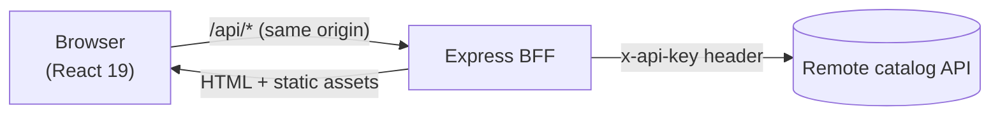
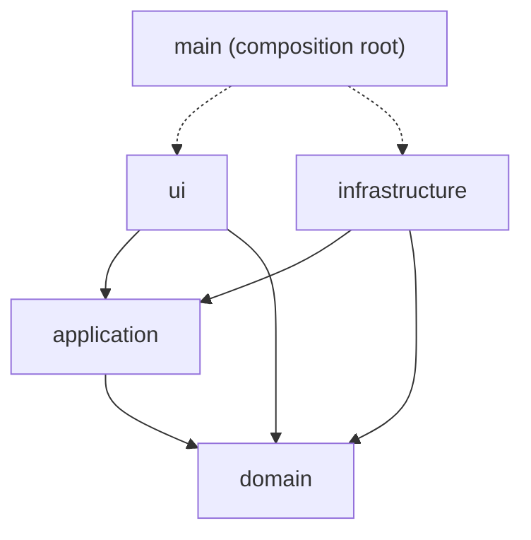

# Architecture

> Status: target design. Sections marked *(planned)* describe code delivered in later chunks (see `technical-proposal.md`). The layering rules below are already enforced by `pnpm check:arch`.

## Big picture



- One Node process serves the pages, the static assets and `/api/*` (in development Rsbuild serves the assets and proxies `/api` to the BFF).
- The browser only talks to its own origin. The remote API key lives in the BFF's environment and never reaches the client.
- The remote API is treated as an untrusted, slightly messy dependency: the BFF validates and normalizes everything it returns.

## Why hexagonal

The catalog API, `localStorage`, Express and React are all details that change or fail. Business rules ("the add button needs a color and a storage", "the cart total is the sum of its lines") should not need any of them to be tested or understood. Hexagonal architecture (ports and adapters) gives each detail a replaceable boundary:

- **Tests are fast and honest.** Use cases run against in-memory adapters; no network, no browser.
- **Failure is contained.** A malformed upstream payload is rejected at the adapter and never reaches the domain or the UI.
- **Swapping is cheap.** GrowthBook vs an env-based flag adapter, `localStorage` vs a server cart: same port, different adapter.

## Layers

| Layer | Contains | May import | Must not import |
|---|---|---|---|
| `domain` | Entities, value objects, pure rules, domain errors | itself | anything else (no packages, no Node/DOM, no other layers) |
| `application` | Use cases (BFF) / hooks and context (web), **port interfaces** | `domain` | `infrastructure`, `ui`; in the BFF also no packages |
| `infrastructure` | Adapters: HTTP clients, storage, Express routes, flags | `application`, `domain`, packages | `ui` |
| `ui` (web only) | Pages, components, styles | `application`, `domain` | `infrastructure` |
| composition root | `src/main.ts` / `src/main.tsx`: builds adapters and injects them | everything | (nothing depends on it) |



The rules live in `.dependency-cruiser.cjs` and are checked by `pnpm check:arch`. `tools/architecture/architecture.test.mjs` runs the rules against fixture projects to prove each one fires on exactly the violation it targets.

## Two models, one wire format

The BFF and the web app each own a domain model. `packages/contracts` defines only the **wire format** between them (types plus runtime schemas).

```
upstream JSON --(BFF adapter: validate, normalize)--> BFF domain
BFF domain --(HTTP adapter: map to DTO)--> contracts DTO --(web gateway: parse, map)--> web domain
```

Duplicating a few types is deliberate: each side can evolve its internals without breaking the other, and a contract change becomes a compile error on both sides. `packages/contracts` may not import from any app.

## Ports and adapters *(planned)*

**BFF**

| Port (in `application`) | Adapters (in `infrastructure`) |
|---|---|
| `ProductCatalogPort` (`list`, `getById`) | HTTP adapter for the remote API; in-memory adapter for tests |
| `FeatureFlagsPort` (`isEnabled`) | env-based adapter; GrowthBook adapter (documented) |

Use cases: `ListProducts`, `GetProductDetail`. Driving adapter: Express routes.

**Web**

| Port (in `application`) | Adapters (in `infrastructure`) |
|---|---|
| `CatalogGateway` (`searchProducts`, `getProduct`) | HTTP gateway to `/api`; in-memory gateway for tests |
| `CartStorage` (`load`, `save`) | `localStorage` adapter; in-memory adapter for tests |

Pure rules in `domain`: `Money` (integer cents), `Cart`, `CartLine`, add/remove/total functions, and the product selection rules (when the add button is enabled, which price is shown, which single option gets preselected).

## Error model

| Situation | BFF behavior | What the user sees |
|---|---|---|
| Upstream 404 for a product | typed `ProductNotFoundError` -> HTTP 404 `{ error, message }` | "Product not found" page with a way back |
| Upstream 401 (bad/missing key) | logged as a configuration error -> HTTP 502 | generic error with retry (never leak upstream auth details) |
| Upstream timeout / network failure | `CatalogUnavailableError` -> HTTP 504 or 502 | error state with retry |
| Upstream payload fails schema validation | rejected at the adapter -> HTTP 502 | error state with retry |
| Invalid request (`limit` out of range, etc.) | HTTP 400 | not reachable from the UI; guards the API |

## SSR-safety rules (apply from chunk 4 so chunk 9 is additive)

- No `window`, `document` or `localStorage` access at module scope. Browser APIs are used only in effects or behind an adapter.
- Data fetching goes through the `CatalogGateway` port, so the server can supply a different implementation than the browser.
- The cart count is read after mount; the server renders the empty state, avoiding hydration mismatches.

See also: `bff.md`, `frontend.md`, `decisions/`.
